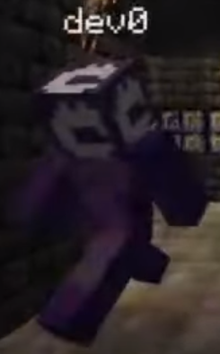
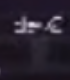
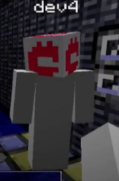
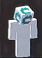
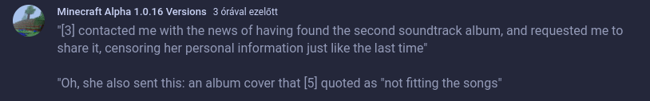

[← Home Page](../README.md#1-basic-lore)

# Developers
There seem to be seven developers.
They are referred to as dev# or just simply #.

|  | *No Image* |  | *No Image* |  | *No Image* |  | 
| ----------------------- | ----------------------- | ----------------------- | ----------------------- | ----------------------- | ----------------------- | ----------------------- | 
| dev0                    | dev1                    | dev2                    | dev3                    | dev4                    | dev5                    | dev6                    | 

### dev0
- Wanted to pitch Lilypad changes to Mojang ([Developer preview](../videos/developer-preview.md))
- Wanted every group of chunks to feel unique, so gave them randomly generated names ([Feature testing](../videos/feature-testing.md))
- Refused to tell the company name at E3, which led to the devs’ larger project getting dropped ([Presentation](../videos/presentation.md))
- Made the Crab Nebula have some “significance” other than cosmetics ([Sunrise](../videos/sunrise.md))
- *Is antagonistic toward at least one of the dev team members* ([Internal footage 2](../videos/internal-footage-2.md), [Presentation](../videos/presentation.md))
- *Has possibly been updating the versions since their release* ([Discovered](../videos/discovered.md))

### dev1
- Can be seen as a name on the forums in [Internal footage 2](../videos/internal-footage-2.md)
- Recorded [Internal footage 4](../videos/internal-footage-4.md)
- Joins Orbl's Other World In [Home](../videos/home.md)

### dev2
- Seen in [Sunrise](../videos/sunrise.md)
- Proposed the Crab Nebula event with dev5 ([Sunrise](../videos/sunrise.md))
- Was the oldest person on the dev team ([Sunrise](../videos/sunrise.md))
- Is dead, confirmed in [Internal Footage 4](../videos/internal-footage-4.md) ~~missing, or left the team~~ ([Sunrise](../videos/sunrise.md))

### dev3
- Was on the art team ([Presentation](../videos/presentation.md))
- Dev6 considered them to be a friend (Presentation)
- Created the OST album artwork ([OST.rar](../resources/ost-rar.md))
- Is a she, confirmed by a community post:  
  

### dev4
- Recorded [Feature testing](../videos/feature-testing.md) and is mentioned in the description
- Was one of the last devs to join the team, worked on the site and bug tracker ([Feature testing](../videos/feature-testing.md))
- Considered by dev6 to be a friend ([Internal footage 3](../videos/internal-footage-3.md))

### dev5
- Proposed the Crab Nebula event with dev2 ([Sunrise](../videos/sunrise.md))
- They composed the OST music ([OST.rar](../resources/ost-rar.md), [OST_2.7z])
- Apparently lives/was born in **Denmark** *(according to composer notes in OST_2, Denmark reminds him of "home")*.

### dev6
- Mentioned in the description of [Entry point](../videos/entry-point.md) and [Version 13](../videos/version-13.md)
- Recorded and wrote the description for [Internal footage 1](../videos/internal-footage-1.md)
- Recorded [Internal footage 2](../videos/internal-footage-2.md)
- Recorded and wrote the description for [Internal footage 3](../videos/internal-footage-3.md)
- Considered devs 4 and 3 to be his friends (internal footage 3, Presentation)
- *Did not want dev0 to know of his whereabouts* (Presentation)
- *Knowingly broke/bent the explicit rules of the Mojang offshoot at least three times* ([Internal footage 1](../videos/internal-footage-1.md), [Internal footage 2](../videos/internal-footage-2.md), [Internal footage 3](../videos/internal-footage-3.md))
