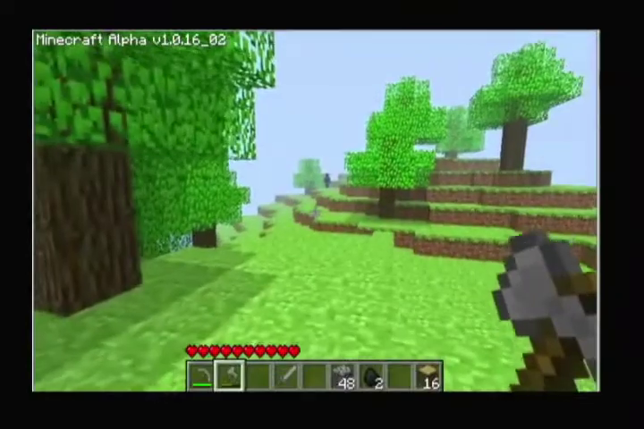

[← Home Page](../README.md#2-videos)

# Video #1: Entry Point
| Post Date  | Minecraft Version          | Length  | FPS | Resolution | Youtube Link      |
| ---------  | -------------------------- | ------- | --- | ---------- | ----------------- |
| 2021-08-01 | Minecraft Alpha v1.0.16_02 | 1:19:16 | 30  | 720x480    | [Watch it here](https://www.youtube.com/watch?v=-vdMzeM15nQ) |

## Description
Date and time unknown, however the year is certainly 2010.
Source of the video is a normal player.
Not much more background info had not been known up to this point, but now, they're with us.

I remember this world. It was started in singleplayer, however we used to run it on a server, until [he] unknowingly got accepted into this into the tests. [He] didn't know what was going on at first, we couldn't even play multiplayer, since version 16.05 didn't have it until its sixth release. And when that finally came, [he] got banned for distributing the jar to someone from outside of the tests, that being me. Luckily, like [6] said, [he] got unbanned a few days later, but the damage has already been done. We didn't have much in common, or anything at that. At that point in life, we'd already split our paths in real life and back then, Minecraft was the only thing keeping us together. These few days when it was taken away from us, were enough to split us apart. It's nothing personal, [6], after all, [he]'s back with us now.

## Original Video
This video apparently once had a different title and description.

### Original Title
Sighting of the entity in 1.0.16

### Original Description
Date and time unknown, however the year is most likely 2010.
Source of the video is a normal player.
Not much more background info is known.

## Characters
* `LORD_OF_THE_FLIES.1998` aka `xorcist6898`:
  Playing and recording the video.  
  > NOTE: With context taken from the video Consequences and the description, this is NOT the "real" xorcist6898. This is a player who borrowed the "real" xorcist's account, and everytime we see xorcist6898 in a video, it's probably them..
* `Jose.gonzales.210` aka `Dj_p155`:
  Second person on Skype.

## Anomalies
* Thumbnail: There may be a player in the window of the thumbnail.
* 0:27:23: Cow and pig fade out of existence.
* 0:41:43: A player appears.
* 1:05:22: The player is gone.

## Gallery

  
  
The shadow player xorcist saw

